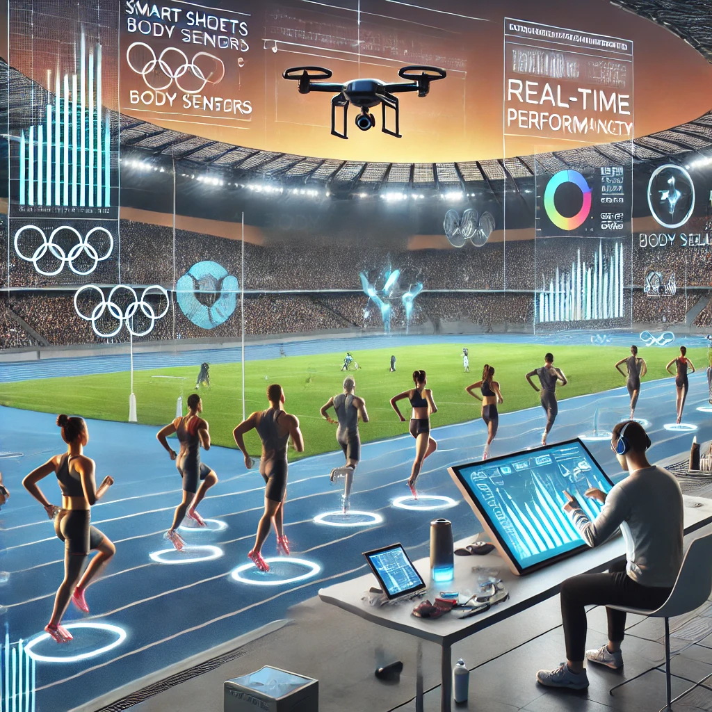
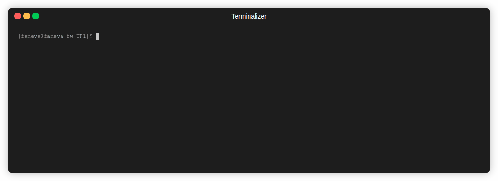
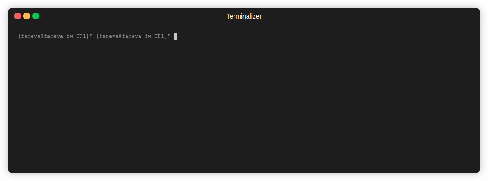
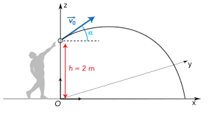

# Travail Pratique #1  

## Introduction

Bienvenue dans ce premier travail pratique du cours d'introduction à la programmation (INF1007) !  
Ce TP est conçu afin de vous introduire et de vous guider à certains concepts fondamentaux de la programmation.  
Vous allez apprendre à résoudre des problèmes simples en utilisant différentes notions telles que : 
- les variables
- les types de données
- les opérateurs
- les instructions 'if'
- la manipulation de chaines de caractères

__Notes:__
- Des tableaux ainsi que des gifs vous sont fournis en guise d'exemple, dans les gifs, les entrées utilisateurs sont en gras, il n'est pas nécessaire qu'ils soient en gras dans votre rendu.
- On assume que l'utilisateur entre toujours un format de donnée valide. Il n'est donc pas nécessaire de faire une vérification de type ou de bornes lors de l'entrée de données __sauf lorsque précisé dans les consignes__.

## Mise en contexte:  

Vous avez été contacté par le comité des Jeux Olympiques de Paris 2024 en tant que contracteur afin de les aider à résoudre différents problèmes qu'ils ont pu rencontrer.  

  
Credits: [DALLE 3](https://openai.com/index/dall-e/)

## Exercice 1:  

Afin de graver dans le marbre la performance des athlètes participant à cette édition des JO, le comité vous demande d'implémenter un script permettant de formatter proprement ce livre de records.  
Consignes:  

- Demander la nationalité de l'athlète
- Demander le nom de l'athlète
- Demander la date du record
- Demander la discipline
- Demander la catégorie, qui peut être nulle
- Demander le record

Conseil: Utilisez le formatage de chaînes pour organiser les informations de manière claire et professionnelle.  

Exemple:  

| Sorties | Entrées |
|:-|:-|
| Nom de l'athlète : | Summer McIntosh |
| Pays représenté : | CAN |
| Date du record : | 1/8/2024 |
| Discipline : | Natation |
| Catégorie: | 200M Papillon |
| Record : | 2:3.03 |
| Nouveau Record: -------------------- 1/8/2024 Natation - 200M Papillon Summer McIntosh CAN - 2:3.03

## Exercice 2: 

Comme vous le savez, l'eau de la Seine n'est pas la plus propre. Afin de permettre aux épreuves en eau libre de se dérouler dans ce cours d'eau, le comité aurait besoin de votre aide pour calculer les différentes ressources nécessaires pour assainir la Seine.  

Afin d'assainir 5L d'eau, il faut :  

- 1 filtre
- 3 lampes UV
- 0,5kg de chlore

Consignes:  

- Demander la quantité d'eau à assainir
- Afficher les quantités totales de chaque matérieau requis

Exemple:  

| Sorties | Entrées |
|:-|:-|
|Quantité d'eau à assainir (en L): | 10 |
| Voici les matériaux requis pour l'assainissement de 10L d'eau: - 2 filtres - 6 lampes UV - 1kg de chlore||

## Exercice 3: 
Afin de prévoir correctement les dimensions possibles de la zone d'atterrissage de l'épreuve du lancer de poids, le comité vous demande de créer un script permettant de calculer la distance maximale en `x` d'une boule lancée par un athlète en fonction de sa vitesse initiale et de l'angle depuis laquelle elle est lancée.
L'image suivante vous montre comment ce poids sera lancé : 

Vous pouvez assumer que la boule sera toujours lancée à une hauteur de 2m et ne se déplacera pas dans l'axe des `y`. 

Vous pouvez utiliser la formule de portée d'un projectile afin de faire ce calcul:  
$$D = \frac{vitesse^2 \times \sin(2 \times angle)}{g}$$

Consignes:  

- Demander la vitesse initiale de la boule
- Demander l'angle de lancement
- Afficher la distance maximale en `x` (en mètres)

**Note**: Vous pouvez lire un exemple pour la fonction sin [ici](https://www.w3schools.com/python/ref_math_sin.asp) !

Exemple:

| Sorties | Entrées |
|:-|:-|
| Vitesse initiale (en m/s): | 20.5 |
| Angle de lancement (en degrés): | 30 |
| La distance maximale en x est de 37.14m |

## Exercice 4: 
Pour une cérémonie d'ouverture en grandes pompes, le comité d'organisation des JO aimerait savoir s'il est possible d'utiliser un certain modèle de bateau électrique. Afin de s'aiguiller dans cette décision, ils vous demandent de mettre en place un script permettant de calculer la distance pouvant être effectuée en fonction du pourcentage de batterie.  

Consignes: 
- Demander le pourcentage de batterie du bateau
- Calculer la distance possible en suivant les règles suivantes: 
  - Entre 50% et 100% de batterie, chaque pourcentage équivaut à 2km
  - Entre 25% et 50% de batterie, chaque pourcentage équivaut à 0,5km
  - Entre 10% et 25% de batterie, chaque pourcentage équivaut à 1km
  - Entre 5% et 10% de batterie, chaque pourcentage équivaut à 2.5km
  - Entre 0% et 5% de batterie, chaque pourcentage équivaut à 6km  
*La borne inférieure n'est pas incluse.
- L'affichage la distance doit être arrondi au km près.  

Exemple:

| Sorties | Entrées |
|:-|:-|
| Pourcentage de batterie: | 75 |
| La distance possible est de 120km |

## Exercice 5: 
Afin de faciliter le suivi et le calcul des médailles gagnées par pays, le comité vous demande de créer un script permettant de traiter la chaîne de caractères suivante: `GBBSBG`.  
- `G` signifie une médaille d'or
- `S` signifie une médaille d'argent
- `B` signifie une médaille de bronze

Consignes: 
- Demander la chaîne de caractères représentant le résultat d'un pays
- Afficher le nombre de médailles de ce pays
- Si un caractère inattendu se glisse dans la chaîne, veuillez afficher une erreur

Exemple: 

| Sorties | Entrées |
|:-|:-|
| Résultat du pays: | GBBSBG |
| Médailles: - Or: 2 - Argent: 1 - Bronze: 2 |

| Sorties | Entrées |
|:-|:-|
| Résultat du pays: | Ceci est une chaîne invalide |
| Veuillez entrer une chaîne valide. |

## Barème

| Exercice | Pondération | 
|:-|:-|
| 1 | 3 |
| 2 | 4 |
| 3 | 5 |
| 4 | 6 |
| 5 | 2 |
| Total | 20 |